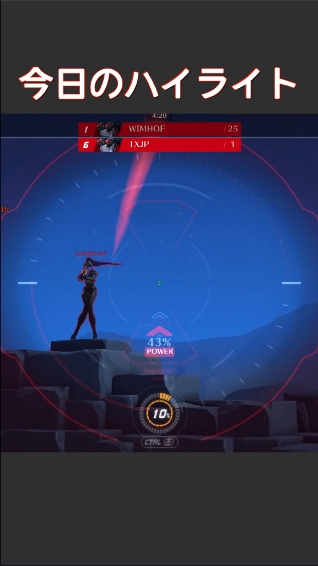

## 1.install ffmpeg

`choco install ffmpeg`

## 2.select scale & Move directory

### basicscale

`cd basicScale`

### 20% upscale

`cd 20%upScale`

### fullscale

`cd fullScale`

## 3. Enjoy!😊

`go run main.go`
# EZZ-Tiktok-Contents-Generator
