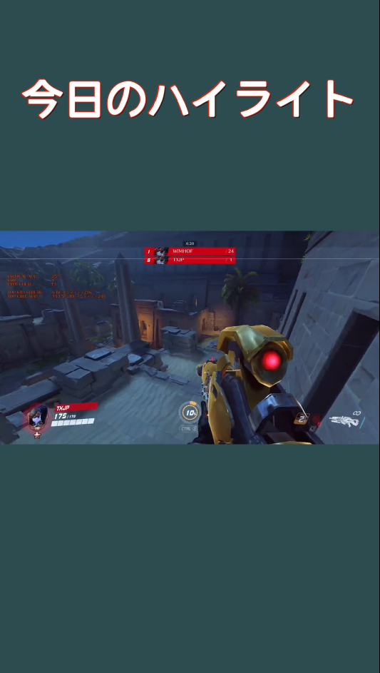
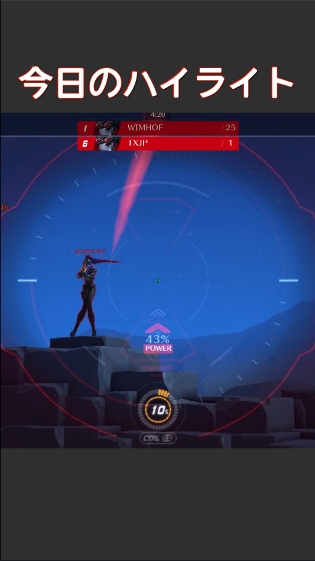
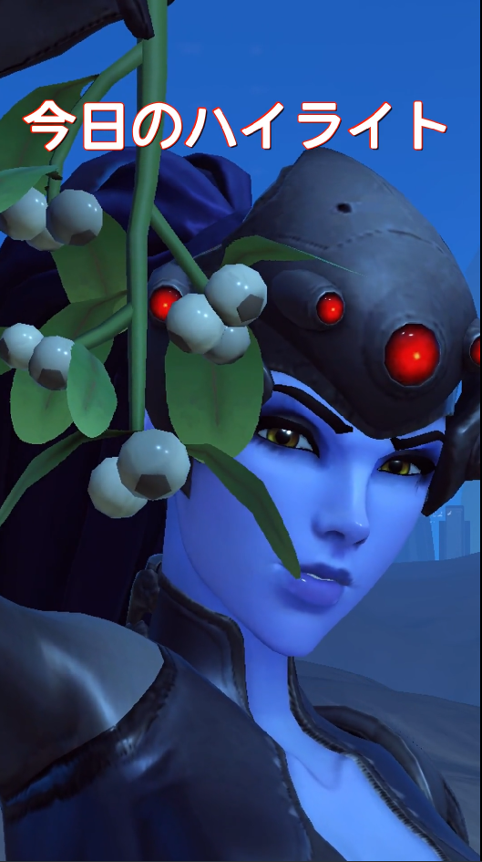

## 1.install Go & ffmpeg

[Install Go](https://go.dev/doc/install)

[Install ffmpeg](https://ffmpeg.org/download.html)

## 2.select scale & Move directory

### basicscale



`cd basicScale`

### 20% upscale



`cd 20%upScale`

### fullscale



`cd fullScale`

## 3. Edit textsetting & backgroundcolor

```
func main() {

	backgroundColor := "2f2f2f" //Feel free to change the color code
	text := "今日のハイライト"          //Feel free to change text

}
```

```
func resizeAndAddText(inputFile, outputFile, text, backgroundColor string, zoomFactor float64) error {
	fontfile := "src/font/JNRfont_n.ttf"
	fontsize := 120
	textColor := "white"
	borderColor := "Red"
	borderWidth := 2
	shadowColor := "black@0.5"
	shadowXOffset := 3
	shadowYOffset := 3
}
```

## 4. Enjoy!😊

`go run main.go`

# EZZ-Tiktok-Contents-Generator
